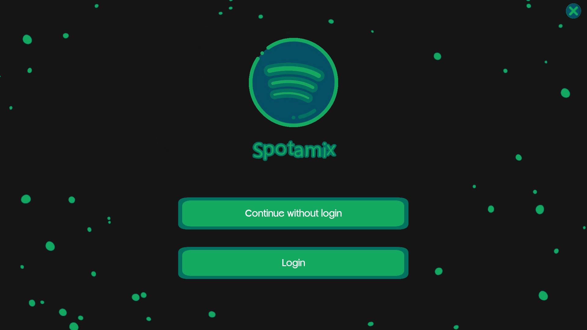
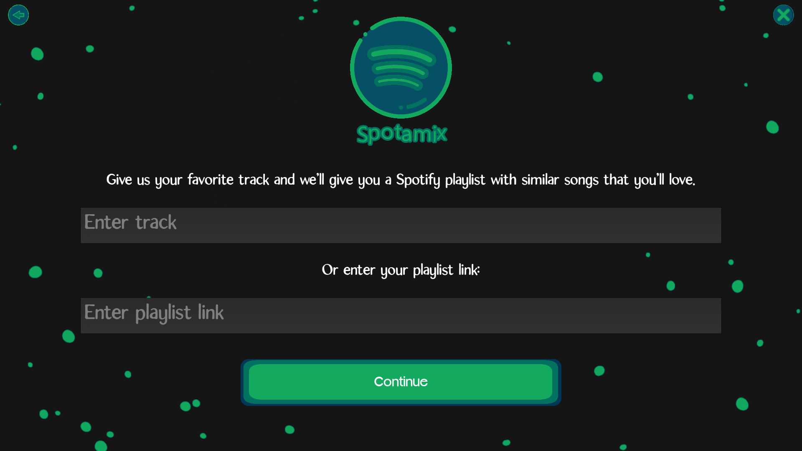
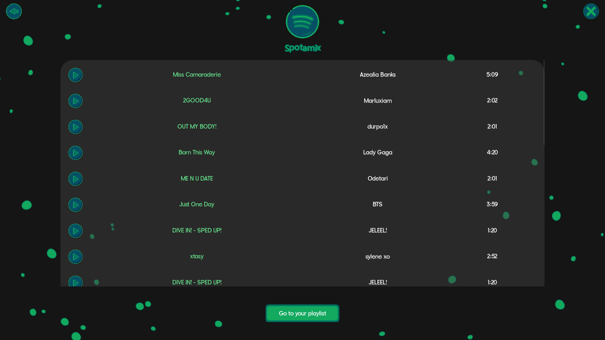
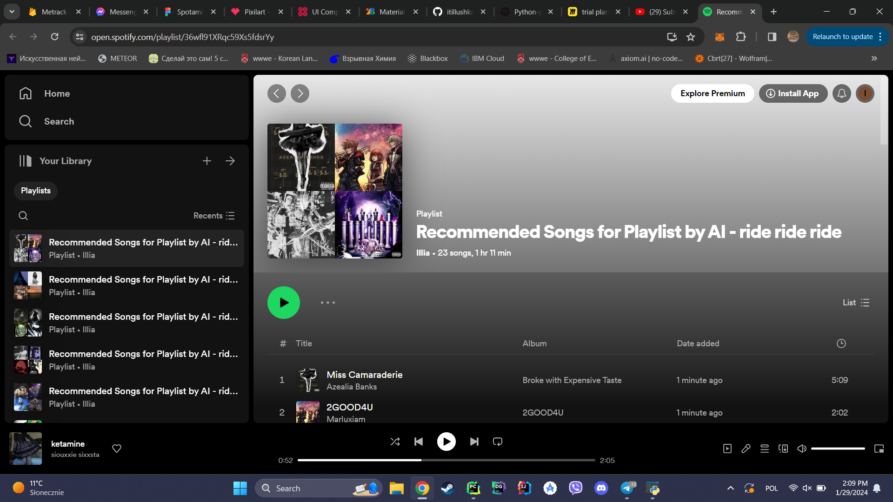

# Python Project WUST 2023

This project is a music recommendation system built with Python. It uses the Spotify API to fetch data about songs and playlists, and applies a recommendation algorithm to suggest songs that the user might like.


The image above shows the login screen of the application.


The image above shows the home screen of the application.


The image above shows the recommendation screen of the application.


The image above shows the spotify playlist located in web browser.

## Project Structure

The project is structured into several modules:

- `Algorithm`: Contains the main logic of the recommendation system, including the recommendation algorithm and functions for fetching data from the Spotify API.
- `Interface`: Handles the user interface of the application.
- `Config`: Contains configuration settings for the application.

## Setup

To set up the project on your local machine, follow these steps:

1. Clone the repository to your local machine.
2. Install the necessary Python packages. You can do this by running the following command in your terminal:
```bash
pip install -r requirements.txt
```
3. Open the `config.py` file and change the `abs_path_to_res` variable to the path where you cloned the repository.
4. Run the `main.py` file located in the `interface` directory. This is the entry point of the application. On the first run, a link will be printed in the terminal.
5. Follow this link and paste it back into the terminal after web authentication process. This will authenticate your Spotify account and allow the application to fetch data from the Spotify API.

## Usage

After setting up the project, you can run the application to get music recommendations based on your Spotify playlists. 

1. Start the application and navigate to the home screen.
2. Click the "Continue" button. Please be patient as the recommendation algorithm processes your Spotify data. This may take a few moments.
3. Once the algorithm finishes, you will be redirected to the "Recommendation Screen". This screen displays a list of recommended songs in a RecycleView. Note: The play button is currently non-functional.
4. Click the "Go to Playlist" button to be redirected to the Spotify playlist with the recommended songs.

## Links

[Figma file with references and development notes](https://www.figma.com/file/WUuUDZ4TGcA971Mv36NWvU/Spotamix?type=whiteboard&node-id=0-1&t=xsr1IDABLd5M64Vt-0)


## Authors

- **it.illushka** - Algorithm and Integration
- **Junoiri** - Design and Front-end development